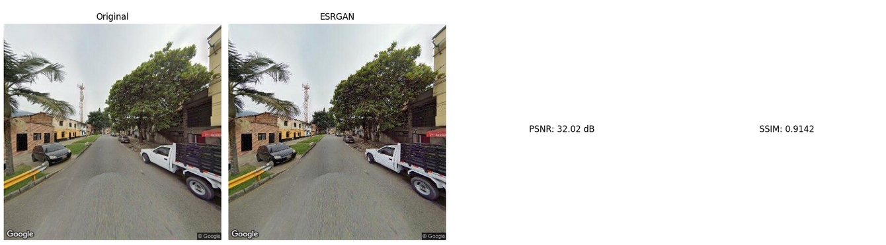

# ESRGAN 
## Project Overview
Implement the ESRGAN (Enhanced Super Resolution Generative Adversarial Network) algorithm to improve the quality of the original images presented. Additionally, metrics such as PSNR (Peak Signal to Noise Ratio) are calculated to evaluate the quadratic error between the original and super resolution generated images. The SSIM (Structural Similarity Index Metric) is also proposed to evaluate the distribution of brightness, contrast and structure details of the images.

## Implementation of ESRGAN Algorithm for Upscaling
The ESRGAN algorithm preserves detail and visual quality through its ability to learn complex patterns. It uses a generative model, which helps to capture finer details in images, resulting in higher visual quality results. This also helps to contain realistic details, which is useful in a diverse number of applications and scenarios. This colab demonstrates use of TensorFlow Hub Module for Enhanced Super Resolution Generative Adversarial Network (*by Xintao Wang et.al.*) [[Paper](https://arxiv.org/pdf/1809.00219.pdf)] [[Code](https://www.tensorflow.org/hub/tutorials/image_enhancing)] for image enhancing. 

## Dataset
Dataset of 72 low-resolution images from the OpenStreetView API is available. The dataset used was the one provided in the following [Github repository](https://github.com/DiversaStudio/Test.git).

## Results

The following represents an example of the original image and the corresponding super resolution image. Additionally, the metrics for PSNR and SSIM are showed in order to evaluate the inference of the model.

## Instructions
- You can easily access to the notebook here: [
- Check that the Runtime type is Python3.
- Check that the hardware accelerator is a GPU.
- Run all cells or run cell by cell.

## Software specifications
- Python 3.10.12
- TensorFlow 2.15.0

## Hardware specification
- Tesla T4, VRAM 16GB

**Note**: The notebook contains a full description and comments in code about the followed steps in order to develop the project. Also, all the necessary libraries are imported. Python, Tensorflow, and all used libraries are already installed in the environment of Google Colab. Therefore, no conflict should be presented during the execution. 
